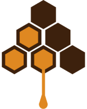

# Farmer App - Smart Beekeeping Monitoring System




## Overview

HPGM (Honey Productivity, Guide and Monitor) is a comprehensive Flutter application designed to help beekeepers track hive productivity, monitor bee activity, and make data-driven decisions based on environmental correlations. The application provides real-time analytics on bee behavior, hive conditions (temperature, humidity, weight), and visualizes correlations between environmental factors and bee activity.

## 🐝 Key Features

- **Apiary Management**: Track and manage multiple apiaries and hives
- **Environmental Monitoring**: Real-time temperature, humidity, and weight data
- **Bee Activity Tracking**: Advanced bee counting system with entry/exit analytics
- **Correlation Analysis**: Analyze relationships between bee activity and environmental factors
- **Media Management**: Capture, store, and analyze photos and videos of hives
- **Smart Insights**: AI-driven insights and recommendations based on collected data
- **Background Monitoring**: Continuous data collection even when the app is not in active use
- **PDF Reporting**: Generate detailed bee foraging analysis reports
- **Dashboard**: View key metrics and performance indicators
- **Multi-platform**: Works on Android, iOS, Web, Windows, Linux, and macOS

## ✨ What's New

- **Integrated Hive Monitoring**: Enhanced visualization combining temperature, humidity, weight, and bee count data in a single view
- **Data Caching**: Improved processing speed for bee counting analytics
- **Correlation Dashboard**: Comprehensive visualization showing relationships between bee counts and environmental metrics
- **Dynamic Insights**: Automated data analysis that provides actionable recommendations based on actual correlation values

## 📊 Data Visualization & Analytics

The app features advanced data visualization capabilities to help beekeepers understand their hive conditions:

- **Time-Series Charts**: Track temperature, humidity, weight, and bee activity over time
- **Correlation Analysis**: Identify relationships between environmental factors and bee behavior
- **Smart Insights**: Get AI-generated recommendations based on your hive's specific data
- **Combined Views**: See multiple metrics together for comprehensive analysis

## 🔧 Technical Stack

- **Frontend**: Flutter for cross-platform mobile development
- **State Management**: Provider and built-in State management
- **Data Visualization**: FL Chart and Flutter ECharts
- **Local Storage**: SQLite with SQFlite
- **Background Processing**: Flutter Background Service
- **Media Processing**: TFLite for bee counting from images
- **Notifications**: Flutter Local Notifications
- **Security**: Flutter Secure Storage for sensitive data

## 🚀 Getting Started

### Prerequisites

- Flutter SDK (version 3.7.0 or higher)
- Dart SDK (version 3.7.0 or higher)
- Android Studio / VS Code with Flutter extensions
- Git

### Installation

1. Clone the repository:
```bash
git clone https://github.com/yourusername/farmer_app.git
cd farmer_app
```

2. Install dependencies:
```bash
flutter pub get
```

3. Run the application:
```bash
flutter run
```

### Setting Up Development Environment

1. Ensure you have set up Flutter development environment
2. Configure Android SDK and/or iOS development tools
3. Install required emulators/simulators

## 🛠️ Building for Different Platforms

### Android
```bash
flutter build apk --release
```

### iOS
```bash
flutter build ios --release
```

### Web
```bash
flutter build web --release
```

### Windows
```bash
flutter build windows --release
```

### Linux
```bash
flutter build linux --release
```

### macOS
```bash
flutter build macos --release
```

## 🏗️ Architecture

HPGM follows a modular architecture with separate components for:

- **UI/Presentation Layer**: UI screens and widgets
- **Business Logic Layer**: Services and repositories
- **Data Access Layer**: Local databases and API clients
- **Domain Layer**: Models and entities
- **External Services Integration**: Weather APIs, background services

The app uses various Flutter packages for PDF generation, data visualization, and device sensor integration.

## 🧩 Main Components

The Farmer App consists of several key components working together:

1. **Bee Counter System**: Analyzes videos to count bees entering and exiting hives
2. **Integrated Hive Monitoring**: Combines environmental data with bee activity
3. **Analytics Engine**: Processes data to find correlations and generate insights
4. **Background Service**: Continuously monitors and processes data
5. **Visualization Components**: Renders interactive charts and graphs
6. **Database Layer**: Stores and manages all collected data efficiently

## 🧪 Testing

Run tests using:

```bash
# Run unit tests
flutter test test/unit/

# Run widget tests
flutter test test/widget/

# Run a specific test file
flutter test test/unit/app_utils_test.dart
```

## 📚 Documentation

Comprehensive documentation is available to help developers understand and extend the application:

- [Technical Documentation](DOCUMENTATION.md) - Full codebase documentation
- [Bee Counter System](docs/bee_counter_system.md) - Details on bee counting implementation
- [Data Visualization](docs/data_visualization.md) - Guide to the visualization components
- [Integrated Hive Monitoring](docs/integrated_hive_monitoring.md) - Monitoring system documentation

## 🤝 Contributing

We welcome contributions to the Farmer App project! Please follow these steps:

1. Fork the repository
2. Create a new branch (`git checkout -b feature/amazing-feature`)
3. Make your changes
4. Commit your changes (`git commit -m 'Add some amazing feature'`)
5. Push to the branch (`git push origin feature/amazing-feature`)
6. Open a Pull Request

## 📄 License

This project is licensed under the MIT License - see the LICENSE file for details.

## Contact

For questions or support, please contact [your-email@example.com]
